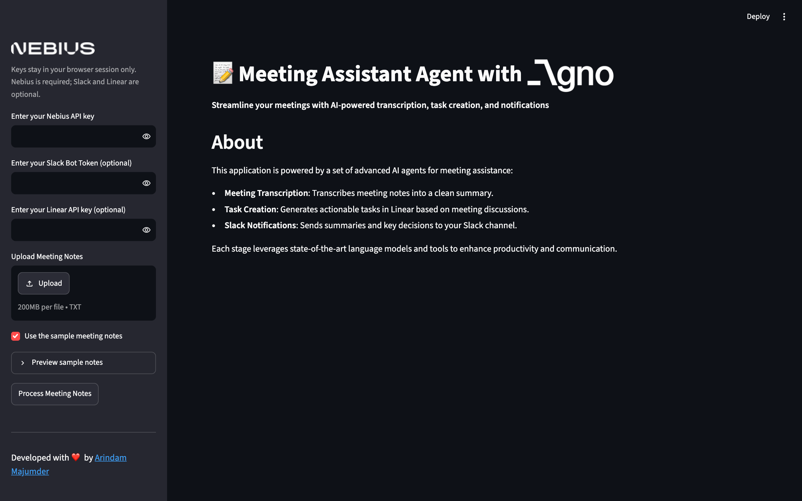
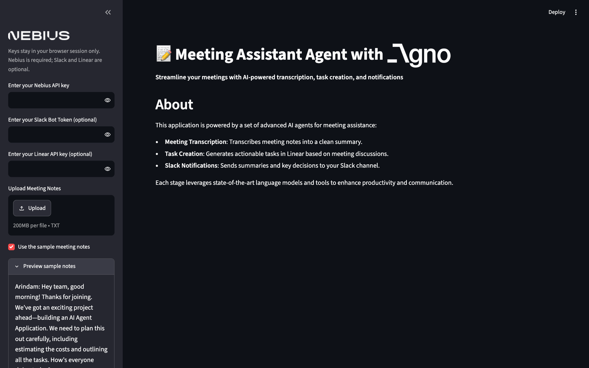
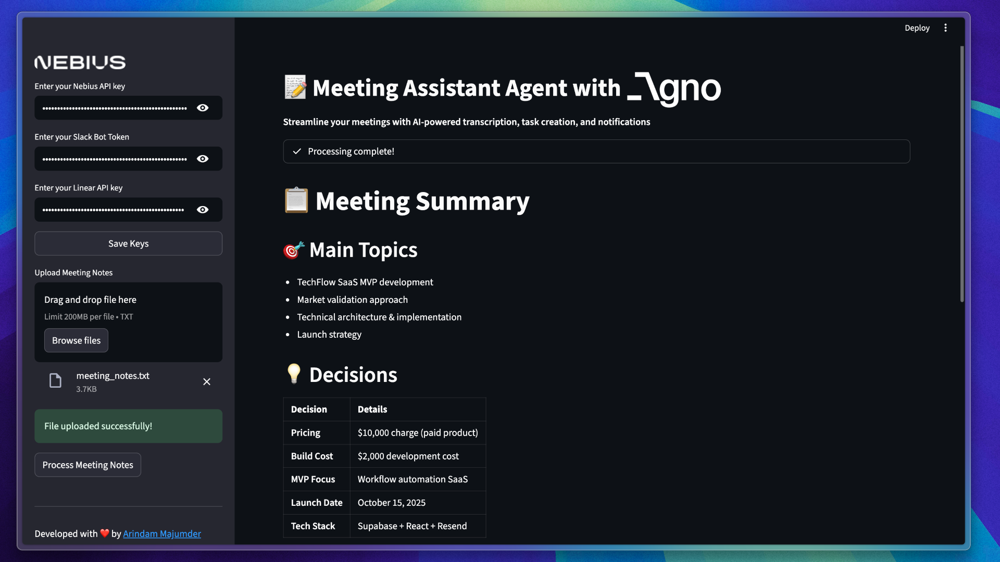

# Meeting Assistant Agent — Agno, Nebius, Slack & Linear


👤 **Portfolio:** [s-harshni.github.io/S-Harshni/](https://s-harshni.github.io/S-Harshni/)

An AI agent workflow that turns raw meeting notes into a clean summary, creates **Linear** tasks for the action items, and posts a recap to **Slack**, all from a Streamlit app. Agents are orchestrated with **Agno** workflows on an LLM served by **Nebius AI Studio** (Kimi-K2-Instruct).



## How it works

```
meeting notes (.txt) ─► Transcription agent ─► ┬─► Linear agent  (create tasks)    ┐
                        (FileTools: read,       └─► Slack agent   (post recap)      ├─► Summary agent ─► Markdown summary
                         write summary)            parallel, only if keys are set   ┘
```

| Agent | Tools | Output |
|---|---|---|
| Meeting transcription | Agno `FileTools` (sandboxed to a per-run temp folder) | Structured summary: goals, costs, pricing, stack, timeline, owners, deadlines |
| Linear task agent | `LinearTools` | One Linear issue per action item (title, description, assignee, deadline) |
| Slack notification agent | `SlackTools` | Recap message with decisions, tasks and next steps |
| Summary agent | none | Final Markdown summary shown in the app |

The workflow is built **per session** (`build_workflow()` in `main.py`) from the keys typed in the sidebar. Keys are never written to environment variables, so on a shared server each visitor only uses their own. Slack and Linear steps are added only when their keys are provided.

## Screenshots

| Sidebar: keys, upload, sample notes | Sample output (from the original project) |
|---|---|
|  |  |

## Run locally

```bash
git clone https://github.com/S-Harshni/Smart-Meeting-Assistant-Agent.git
cd Smart-Meeting-Assistant-Agent
pip install -r requirements.txt          # or: uv sync
streamlit run app.py                      # http://localhost:8501
```

Enter a **Nebius API key** ([studio.nebius.com](https://studio.nebius.com)) in the sidebar. Add a Slack bot token and a Linear API key to also create tasks and post to `#agent-chat`. Use the bundled sample notes or upload your own `.txt` file, then click **Process Meeting Notes**.

To run without the UI: set `NEBIUS_API_KEY` (plus optional `SLACK_BOT_TOKEN` / `LINEAR_API_KEY`) in `.env` and run `python main.py`.

**Deploying:** the app runs as-is on [Streamlit Community Cloud](https://share.streamlit.io). Point it at `app.py` with Python 3.11 and no secrets needed, since visitors bring their own keys.

## Project structure

```
app.py             Streamlit UI: per-session keys, upload/sample notes, streaming step status
main.py            build_workflow(): Agno agents + workflow (parallel Slack/Linear steps)
meeting_notes.txt  sample meeting transcript
requirements.txt   pinned dependencies (agno 3.x, streamlit, slack-sdk, openai)
.streamlit/        dark theme (the Nebius/Agno logos are white)
```

## Changes in this version

- Keys entered in the sidebar are actually used. The agents used to be created at import time from `.env`, so sidebar keys were ignored.
- Keys stay per session instead of in shared `os.environ`. Uploads go to a per-run temp folder.
- Slack and Linear are optional. Added a sample-notes option and clear errors for invalid keys.
- Updated to the Agno 3 workflow API. Fixed an asset path that broke on Linux (`Nebius.png` → `nebius.png`).

## Credits

Based on the Meeting Assistant Agent from [Arindam Majumder's awesome-ai-apps](https://github.com/Arindam200/awesome-ai-apps) (sample notes and demo image from that project).

## Author

**S Harshni** · [Portfolio](https://s-harshni.github.io/S-Harshni/) · [LinkedIn](https://www.linkedin.com/in/ks-harshni/) · [GitHub](https://github.com/S-Harshni)
