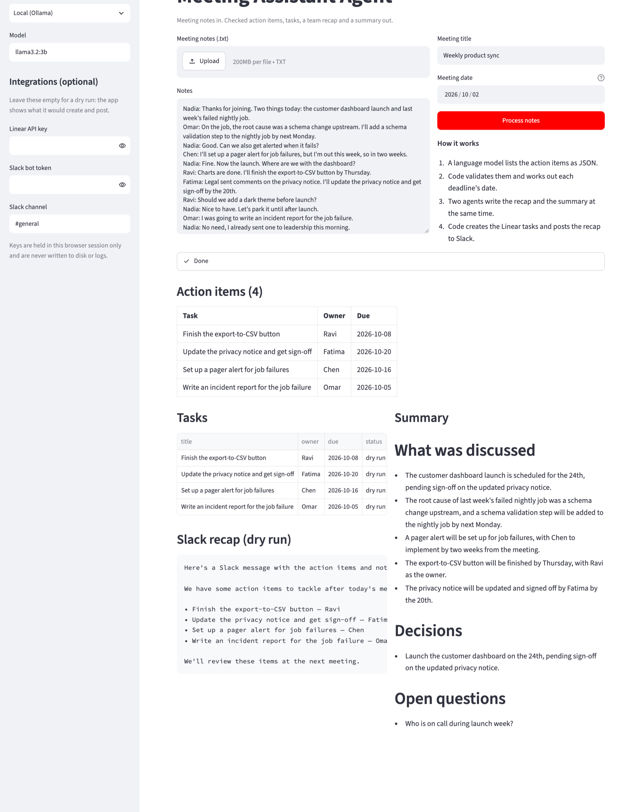

# Meeting Assistant Agent


Meeting notes in; **validated action items, Linear tasks, a Slack recap and a summary** out. The language model is used only where judgement is needed. Everything with a right answer (dates, who exists in the notes, creating tasks, posting) is done by code, and the difference is measured.

**Project page:** https://s-harshni.github.io/Smart-Meeting-Assistant-Agent/



## How it works

```
notes ──► Extractor ──► validation + deadline tool ──┬──► Linear: one task per item      (code)
          (LLM, JSON)    (code)                       ├──► Recap agent ──► Slack message  (LLM writes, code posts)
                                                      └──► Summary agent ──► Markdown     (LLM)
```

| Step | Who does it | What happens |
| --- | --- | --- |
| Extract | Language model | Lists the action items as JSON: task, owner, and the deadline *as it was said* ("next Friday", "the 20th"). |
| Validate | Code ([`actions.py`](actions.py)) | The reply must parse. Empty tasks are dropped, an owner who never appears in the notes is removed, and a date the model worked out by itself is not trusted. |
| Resolve deadlines | Code (`resolve_due`) | A deterministic tool turns the phrase into a calendar date from the meeting date. |
| Write | Two Agno agents, in parallel ([`pipeline.py`](pipeline.py)) | One writes the Slack recap, one the summary (discussion, decisions, open questions). Both receive the checked action items, so they cannot invent tasks. |
| Act | Code ([`integrations.py`](integrations.py)) | Creates one Linear issue per item (assigned when a workspace member's name matches) and posts the recap to Slack. Without keys it does a dry run and shows what it would send. |

Any OpenAI-compatible model works. By default the app uses a local model through [Ollama](https://ollama.com), so it runs with no key and nothing leaves the laptop; Nebius AI Studio is available as a hosted option.

## Does it work? A measured evaluation

[`evaluation/`](evaluation) holds **18 hand-labelled meetings with 49 action items**. They include the things that trip an extractor up: ideas nobody took, tasks cancelled later in the meeting, tasks already done, deadlines given as relative phrases, and one meeting with nothing to do.

Each model was run twice: computing the deadline dates itself, and copying the phrase for the tool to resolve.

| Model | Action-item F1 | Precision | Recall | Right owner | Right deadline, model does the date | Right deadline, tool does the date |
| --- | ---: | ---: | ---: | ---: | ---: | ---: |
| llama3.2:3b | 82.3% | 97.2% | 71.4% | 100% | 48.3% | **97.0%** |
| gemma2:2b | 85.2% | 82.7% | 87.8% | 100% | 44.7% | **82.5%** |
| qwen2.5:3b | 77.8% | 85.4% | 71.4% | 100% | 34.2% | **93.8%** |

- **Moving the calendar arithmetic out of the model takes deadline accuracy from 34–48% to 83–97%.** Small models are poor at date arithmetic; a tool is not.
- Asked for dates directly, two of the three models also put deadlines on tasks that had none. With the tool path none did. (The set has only three such tasks, so this is an observation, not a rate.)
- Owners are right almost every time. The errors that remain are missed items (recall 71–88%) and ideas reported as tasks.

The meetings are short and were written for this project, so read the table as a comparison between set-ups, not as a benchmark. Three models of 2 to 3 billion parameters were used, 4-bit quantised, on a laptop.

## Run it

```bash
git clone https://github.com/S-Harshni/Smart-Meeting-Assistant-Agent.git
cd Smart-Meeting-Assistant-Agent
python -m venv .venv && source .venv/bin/activate
pip install -r requirements.txt

ollama pull llama3.2:3b            # a local model; or pick Nebius in the sidebar and paste a key
streamlit run app.py               # http://localhost:8501
```

Paste notes or use the bundled sample, set the meeting date, and press **Process notes**. Add a Linear API key and a Slack bot token in the sidebar to create real tasks and post the recap; leave them empty for a dry run.

```bash
pytest -q                          # 47 tests, no model or network needed
python evaluation/evaluate.py      # re-runs the table above (needs Ollama and the three models)
```

## Tests

47 tests, run in CI:

- **Deadline tool:** 23 phrasings against hand-computed dates, and inputs it must refuse ("soon", "February 30").
- **Validation:** malformed replies, empty tasks, owners that are not in the notes, dates invented by the model.
- **Scoring:** one-to-one matching of extracted and labelled items, checked on a hand-worked case.
- **Integrations:** the exact Linear and Slack requests against a mock server; rejected keys and unknown channels are reported.
- **Pipeline:** end to end with a scripted model; a failing Slack call does not lose the tasks.
- **Labelled data:** every labelled deadline is consistent with the tool and every owner appears in the notes.

## Project structure

```
actions.py          extraction prompt, validation, deadline tool (resolve_due), scoring
pipeline.py         the pipeline: extractor, two Agno writing agents in parallel, integrations
integrations.py     Linear (GraphQL) and Slack (Web API) clients with dry-run mode
app.py              Streamlit front end
evaluation/         18 labelled meetings, evaluate.py, results.json
tests/              47 tests
sample_meeting.txt  sample notes used by the app
```

## Limitations

- Evaluated on short, clean, English meeting notes written for the project; real transcripts are longer and messier.
- The deadline tool reads common phrasings only. Anything it cannot read becomes "no deadline" rather than a guess.
- Owners are matched to Linear members by first name; two people with the same first name need a manual check.
- The recap and summary texts are not scored, only the action items are.

## Author

**S Harshni** · [Portfolio](https://s-harshni.github.io/S-Harshni/) · [LinkedIn](https://www.linkedin.com/in/ks-harshni/) · [GitHub](https://github.com/S-Harshni)
